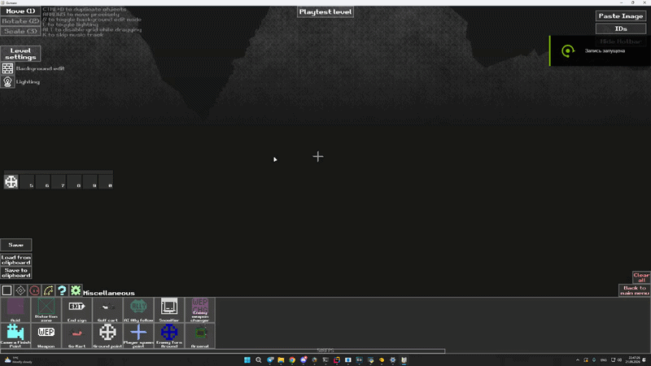

# Gunsaw Level Editor Tools

## Features

### Alternative prop scale / rotation editing system

Toggle on and off using Ctrl + M (hold ALT to disable snapping)


### Door target visualization

Hold shift to set door target, hold ALT to disable 15 degree snapping


Also works with Door Target Changers


### Ground points visualization

Ctrl + G to toggle


### Ground points auto ID

When a new groundpoint is created, it is automatically assigned an ID from the range 600000–600999. If you select a groundpoint and then right-click while holding down the Shift key, groundpoints with the same ID will be placed at the click location



### Colorpicker for lamps


### Prop connections & ID list

Displays props associated with a single ID. Can be toggled by L key. ID list shows a list of reserved IDs (sorted in descending order)


### Hotbar

Allows you to create a list of frequently used props. Hold down a slot number and click on a prop in the editor's standard list to add it to that slot; after that, clicking on that slot number selects it as the cursor. Left-click to place it and clear the cursor; right-click to place it without clearing the cursor


### Image converter

Allows you to create art from props and pixel art; requires careful adjustment to achieve a good result


### Other minor additions

- Multiselection while holding down the Shift key
- Cyclical arrow keys press
- Removed warning that appears when opening the editor
- Ctrl + Z & Ctrl + Shift + Z to undo & redo

This mod is still a work in progress. It may be incompatible with LevelEditor+; to disable the mod's key bindings, use Ctrl + U

## Installation

1. Download [Gunsaw](https://orsonik.itch.io/gunsaw-demo/purchase)
2. Extract the game to C:\Games\Gunsaw (or another folder)
3. Start the unmodified game once, then close it
4. Install [BepInEx](https://github.com/bepinex/bepinex/releases) into the game folder — the folder that contains the `Gunsaw.exe`
5. Download `GunsawLevelEditorTools.dll` from releases
6. Copy the `GunsawLevelEditorTools.dll` to ```<Gunsaw folder>\BepInEx\plugins\GunsawLevelEditorTools.dll```
7. Download `GunsawArtConverter.exe` from releases if you want to convert images

## Credits

- [Orsoniks](https://github.com/Orsoniks) for **Gunsaw**
- [BepInEx team](https://github.com/BepInEx) for [BepInEx](https://github.com/BepInEx/BepInEx), [HarmonyX](https://github.com/BepInEx/HarmonyX) and [AssemblyPublicizer](https://github.com/BepInEx/BepInEx.AssemblyPublicizer)
- [OpenAI](https://github.com/OPENAI) for **GPT 5.6**

## Disclaimer

This is a community-made, unofficial modification. It is not affiliated with, endorsed by,
or supported by Orsoniks or the developers of Gunsaw. This repository does not claim ownership
of Gunsaw, its characters, assets, code, or any other original-game rights. You must obtain
Gunsaw from its official source before using this mod
